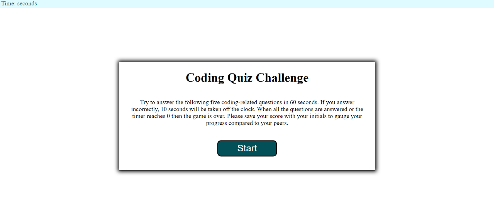

# Code-Quiz

## Description

- My motivation in completing this project was to be able to apply all the JavaScript knowledge I had learned this week to a real world quiz that could be modified for different content. 

- I built this project because I wanted to test my skills and see how I could apply JavaScript to the quiz.  

- The problem solved while working on this project was helping the code make decisions based on clicks. 

- Through this project I learned how to create a website that goes from one question to another without having to link a new page. 

- I faced many challenges with this project. Getting the interval to stop at certain points was difficult. I eventually learned that setting my timeInterval = null in global allowed me to call on it later. I had a hard time making the time-off-for-incorrect-selections not compound on itself, and same with the scores. I became very aware of how much I don't know because my code is long and repetitive. I would love to learn more about how to simplify something like this. 

- In the future, I would like to take some time to learn more about how to apply for loops to make my code more condensed. I would also like to fix my CSS to look it's best when resizing.

## Website Appearance

## Link to Deployed Application:

https://srandall1213.github.io/Code-Quiz/